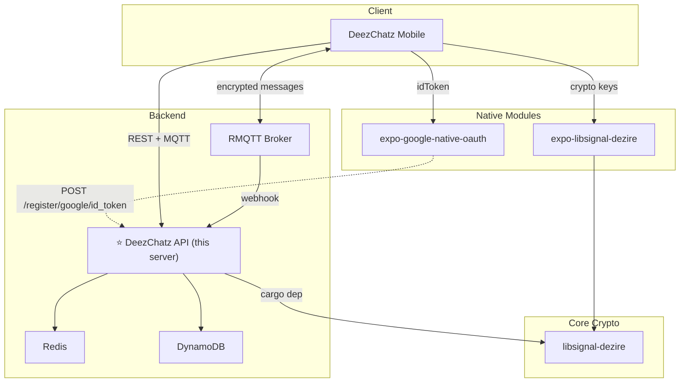

# DeezChatz API 🚀

[](https://www.rust-lang.org/)
[](https://opensource.org/licenses/MIT)
[]()

The backend engine behind the [DeezChatz](https://github.com/deez-in) encrypted messaging ecosystem. Built with Rust and Axum, it operates on a strict **Zero-Trust** policy — we route messages, verify keys, and trigger push notifications, but we **never** touch your plaintext or private keys. Why? Because ain't nobody reading Deez Chatz. Your messages belong to nobody but you and yours truly. Here at 'Deez', we don't hoard data — storing useless logs costs real money and burns trees, and frankly... ain't nobody paying cloud bills to host your 3 AM chatzzzz. 🔒🔥

## Where This Fits



## What This Server Does

The DeezChatz API handles **three main jobs**:

1. **Identity Registry** — Verifies Google OAuth tokens, creates user profiles, and stores public keys in DynamoDB. No private keys ever touch the server.

2. **Pre-Key Bundle Server** — Serves public pre-key bundles so clients can perform X3DH key exchanges locally without the server meddling.

3. **Offline Push Gateway** — When a message hits the MQTT broker while the receiver is offline, RMQTT pings the API via webhook to trigger a data-only FCM push notification to wake the client up.

## Tech Stack

| Component | Technology |
|-----------|------------|
| **Language** | [Rust](https://www.rust-lang.org/) (Axum framework) |
| **Database** | [Amazon DynamoDB](https://aws.amazon.com/dynamodb/) (Single-Table Design) |
| **Cache** | [Redis](https://redis.io/) (pending registrations, replay protection) |
| **Message Broker** | [RMQTT](https://rmqtt.io/) (MQTT broker for real-time delivery) |
| **Crypto** | [libsignal-dezire](https://github.com/deez-in/libsignal-dezire) (VXEdDSA verification) |
| **Push** | Firebase Cloud Messaging (FCM) |
| **Container** | OCI-compliant image via GitHub Container Registry |

---

## Quick Start

### Prerequisites

- **Rust** 1.75+ (`rustup update`)
- **Docker & Docker Compose** (for Redis and RMQTT)
- **AWS credentials** (for DynamoDB — or use DynamoDB Local)

### Local Development

```bash
# 1. Clone
git clone https://github.com/deez-in/deezchatz-api.git
cd deezchatz-api

# 2. Configure environment
cp .env.example .env
# Edit .env with your AWS, Google OAuth, and Redis credentials

# 3. Start supporting services
docker-compose up -d   # Starts Redis + RMQTT

# 4. Run the API
cargo run
# Public API starts on port 3000
# Private API starts on port 3001
```

### Running with Docker

```bash
docker pull ghcr.io/deez-in/deezchatz-api:latest
docker run -p 3000:3000 -p 3001:3001 --env-file .env ghcr.io/deez-in/deezchatz-api:latest
```

Images are available for both `linux/amd64` and `linux/arm64`.

---

## Documentation

Start with the concepts guide, then explore the detailed docs:

| Document | What it covers |
|----------|---------------|
| [**Concepts Guide**](docs/concepts.md) | Start here — Zero-Trust philosophy, identity model, registration and messaging flows explained narratively |
| [**Architecture Guide**](docs/architecture.md) | System architecture — DynamoDB schema, MQTT topic design, infrastructure, environment variables |
| [**Cryptographic Flows**](docs/cryptographic_flows.md) | Detailed Mermaid diagrams of VXEdDSA verification, registration, auth, and X3DH flows |
| [**API Reference**](docs/api.md) | Complete endpoint documentation with request/response schemas and cURL examples |
| [**Development Guide**](docs/development.md) | Local setup, project structure, testing, and deployment |

---

## Security

DeezChatz is designed with a security-first mindset. The server operates on a Zero-Trust model:

- **No plaintext access** — Messages are opaque ciphertext; the server never decrypts them.
- **No private keys** — All key generation happens on the client. The server only stores public keys.
- **Signature-based auth** — No JWTs or sessions. Every authenticated request is verified with VXEdDSA signatures.
- **VRF integrity** — Registration and auth both verify VRF outputs, proving the signer holds the private key.

If you discover security vulnerabilities, please refer to our [Security Policy](SECURITY.md) (coming soon).

---

## License

This project is licensed under the MIT License. See the [LICENSE](LICENSE) file for details.
