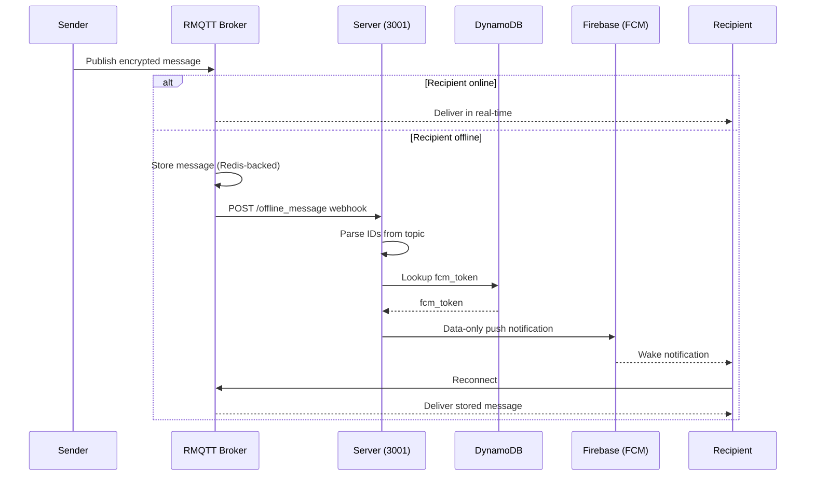

# Architecture & Design Guide

KhamoshChat is built on the principle of **Zero-Trust**. This document outlines how the system achieves security, scalability, and flexibility.

## 1. Security Model (Zero-Trust & E2EE)

The backend is strictly a **message router** and **identity registry**. It does not generate, store, or have access to:
- User private keys.
- Plaintext message content.
- Cryptographic session secrets.

### VXEdDSA Signatures & VRF
All cryptographic signatures in the system use the **VXEdDSA** scheme, which produces both a signature and a Verifiable Random Function (VRF) output. The VRF output acts as an additional integrity check:
- During registration, clients sign both their **Signed Pre-Key** and **Signed Device Key** with their Identity Key, submitting the signature and VRF output for each.
- The server verifies each signature and confirms the VRF output matches, ensuring the signer provably holds the Identity Key.
- The VRF output is **not stored** server-side; it is verified at the time of the operation and discarded.

### X3DH (Extended Triple Diffie-Hellman)
The system facilitates the X3DH protocol by acting as a repository for Pre-Key Bundles. 
1. Clients upload their **Identity Key (iKey)**, **Signed Pre-Key**, and **One-Time Pre-Keys (OPKs)**.
2. When Alice wants to message Bob, she fetches Bob's bundle from the server and initiates a session locally.
3. The server merely delivers the initial handshake and subsequent encrypted messages.

### Stateless Signature Authentication
Client-facing endpoints that operate on existing user data (e.g., FCM token updates) are protected by VXEdDSA signature authentication on the **Public API (port 3000)**.
- **Mechanism**: Every authenticated request must include a VXEdDSA signature of `userId + timestamp`, signed by the device's `signedPreKey`, along with the corresponding VRF output.
- **Headers**: `X-User-Id`, `X-Timestamp`, `X-Signature`, `X-Vrf`.
- **Verification**: The server fetches the user's `signedPreKey` from DynamoDB and verifies the signature and VRF match.
- **Benefit**: No sessions, no JWTs, and the server verifies identity using the same keys used for encryption.

> **Note**: The Private API (port 3001) has no client-facing authentication — it is reserved for trusted backend services (e.g., RMQTT webhooks) and must be network-isolated from public traffic.

## 2. Identity & Entity Model

The system has moved from a phone-number-centric model to a generic identity model.

1.  **Individuals (OAuth)**: Human users registered via OAuth providers (currently Google). This is the primary identity.
2.  **Devices**: Physical or virtual clients owned by Individuals. A single Individual can have multiple Devices (e.g., Phone, Desktop) that sync state.
3.  **Agents (Future)**: AI bots or programmatic scripts that operate with their own cryptographic identities but are owned by an Individual.

## 3. Data Modeling (DynamoDB Single-Table Design)

We use a single DynamoDB table to store all entities, utilizing the Partition Key (`pk`) and Sort Key (`sk`) to model relationships.

### Primary Table Patterns (`khamoshchat-identity`)

| Entity | Partition Key (`pk`) | Sort Key (`sk`) | Description |
| :--- | :--- | :--- | :--- |
| **Profile** | `USER#<userId>` | `PROFILE` | Basic info (name, email, iKey, signedPreKey, signature), with device fields (deviceId, signedDeviceKey, fcmToken) consolidated directly inside this item (until multi-device is supported). |
| **Device** | `USER#<userId>` | `DEVICE#<deviceId>` | Device-specific signed key and FCM tokens (written under `DEVICE#<deviceId>` for future multi-device support, but fetched directly from Profile during key discovery & webhook lookup). |
| **Lookup** | `email` or `phone` | `PROFILE` | (GSI `lookup-index`) Allows finding `userId` via email or phone number. |

### Temporary Storage (Redis)
Redis is used for short-lived state, primarily during the registration handoff:
- **Pending Registration**: Stores Google OAuth claims (`email`, `name`, `picture`) for 10 minutes while waiting for the client to complete Phase 2 (uploading crypto keys).

## 4. Registration Flow

The registration is a two-phase handshake to ensure identity verification precedes cryptographic setup.

```mermaid
sequenceDiagram
    participant C as Client
    participant S as Server
    participant G as Google JWKS
    participant R as Redis
    participant D as DynamoDB

    rect rgb(40, 40, 60)
    Note over C,G: Phase 1 — OAuth Verification
    C->>S: POST /register/google/id_token<br/>{idToken}
    S->>G: Verify token against JWKS
    G-->>S: Claims (email, name, picture)
    S->>D: Lookup existing profile by email
    alt Existing user
        D-->>S: Existing userId
    else New user
        Note over S: Generate new userId (UUID)
    end
    S->>R: Store claims with TTL 10 min<br/>key: reg:pending:{userId}
    S-->>C: {userId}
    end

    rect rgb(40, 60, 40)
    Note over C,D: Phase 2 — Device & Key Setup
    Note over C: Generate iKey, signedPreKey,<br/>signedDeviceKey, OPKs locally
    Note over C: VXEdDSA sign both keys with iKey
    C->>S: POST /register/device<br/>{userId, phone, iKey, signedPreKey, preKeySign,<br/>preKeyVrf, signedDeviceKey, devKeySign,<br/>devKeyVrf, opks}
    S->>R: Fetch pending claims
    R-->>S: {name, email, picture}
    S->>D: Check for existing profile
    alt Existing profile (re-registration)
        Note over S: Preserve createdAt & existing deviceId
    else New profile
        Note over S: Generate new deviceId (UUID) & createdAt
    end
    Note over S: Verify #1: signedPreKey sig + VRF
    Note over S: Verify #2: signedDeviceKey sig + VRF
    S->>D: TransactWriteItems<br/>[Profile, Device]<br/>(Update bundle keys & device info in place)
    S->>R: Delete pending key
    S-->>C: {status: success, userId, deviceId}
    end
```



### Phase 1: OAuth Verification
1. Client sends a Google `idToken` to `/register/google/id_token`.
2. Server verifies the token with Google's JWKS.
3. Server queries DynamoDB GSI (`lookup-index`) by `claims.email`:
   - If an existing profile is found, the existing `userId` is reused.
   - If no profile is found, a new `userId` (UUID) is generated.
4. Server stores claims in Redis under `reg:pending:{userId}` and returns `userId` to the client.

### Phase 2: Device & Key Setup
1. Client generates cryptographic keys locally.
2. Client sends `userId`, `phone`, `iKey`, `signedPreKey`, `preKeySign`, `preKeyVrf`, `signedDeviceKey`, `devKeySign`, `devKeyVrf`, and `opks` to `/register/device`.
3. Server checks DynamoDB for an existing profile under `USER#<userId>`:
   - For re-registering users, it reuses the existing `deviceId` and preserves original `createdAt` metadata.
   - For new users, it generates a new `deviceId` (UUID) and `createdAt` timestamp.
4. Server performs **dual VXEdDSA verification**: validates the signature and VRF for both the signed pre-key and the signed device key against the Identity Key.
5. Server retrieves claims from Redis and commits the updated Profile and Device items to DynamoDB in a single transaction. VRF outputs are verified but **not persisted**.

> For detailed verification flowcharts, see [Cryptographic Flows](cryptographic_flows.md#2-registration-dual-key-verification).

## 5. Messaging Layer (MQTT)

All messages are routed through the MQTT broker. The API server **never sees plaintext**; it only handles delivery bookkeeping.

### Topic Schema

```
/khamoshchat/{recipient_id}/{recipient_device_id}/{sender_id}/{sender_device_id}
```

All four IDs are embedded in the topic, making the routing information self-describing and avoiding any server-side lookup to determine delivery intent.

### Subscription Patterns

| Client subscribes to | Effect |
| :--- | :--- |
| `/khamoshchat/{recipient_id}/#` | Receives messages across all of the user's devices (multi-device sync) |
| `/khamoshchat/{recipient_id}/{recipient_device_id}/#` | Receives messages targeting only this specific device |

### Offline Delivery

When the recipient is offline, RMQTT stores the message (Redis-backed) and fires the `offline_message` webhook to the **Private API (port 3001)**. This port is internal-only — not exposed to clients. The handler:
1. Parses `recipient_id` and `recipient_device_id` from the topic.
2. Looks up the device's `fcm_token` in DynamoDB.
3. Sends a **data-only** push notification (no ciphertext) to wake the client.
4. The client reconnects via MQTT and retrieves the stored message from the broker.


