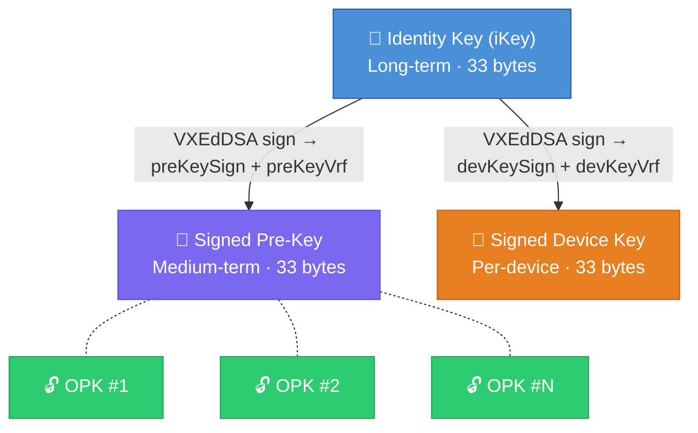
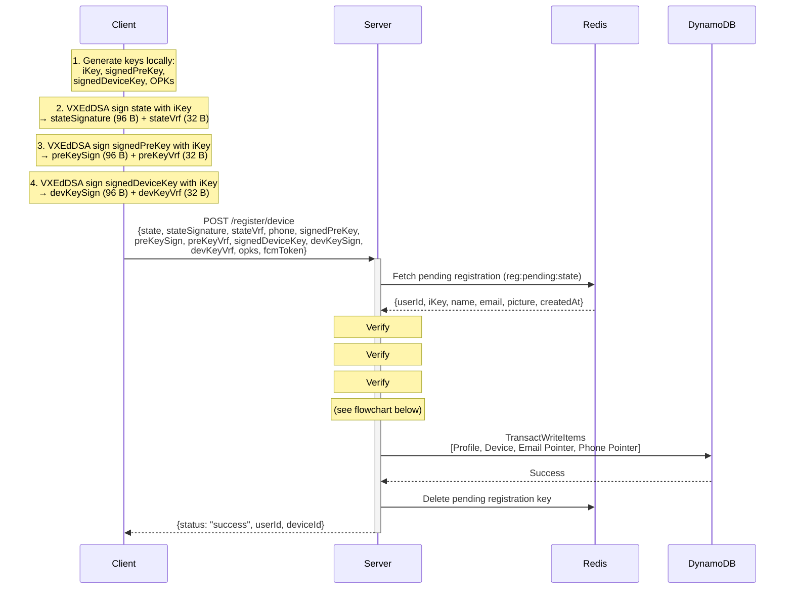
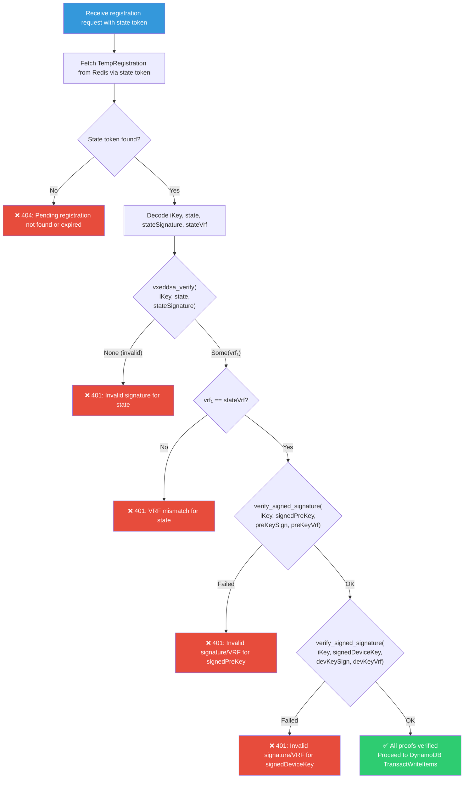
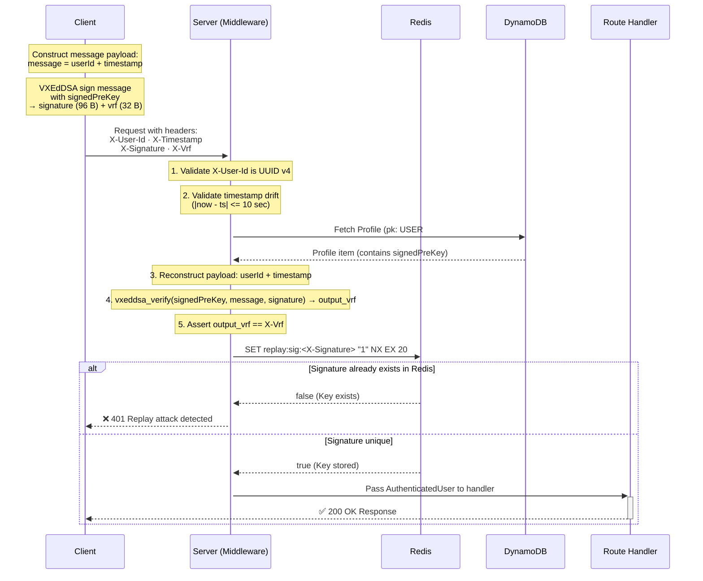
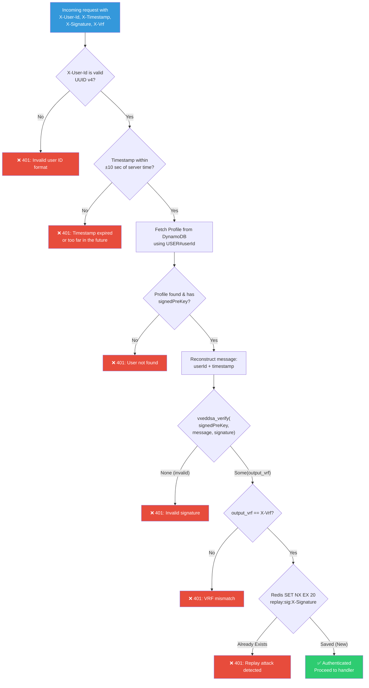
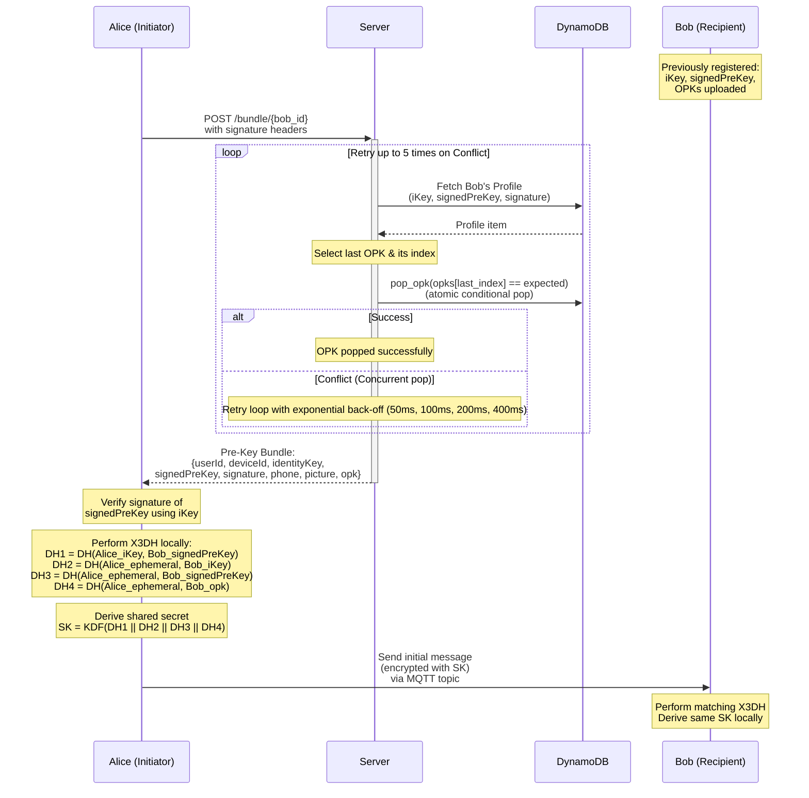

# Cryptographic Operations & Flows

This document details the exact cryptographic operations and verification flows used by the DeezChatz API. It serves as a technical reference for how the server handles keys, verifies signatures, and facilitates key exchange.

For a narrative explanation of these concepts (including *why* we use signature-based auth instead of JWTs), see the [Concepts Guide](concepts.md). For how these flows interact with the database and infrastructure, see the [Architecture Guide](architecture.md).

All signatures in DeezChatz use the **VXEdDSA** scheme, which produces both a cryptographic signature and a Verifiable Random Function (VRF) output.

---

## 1. Key Hierarchy

Before understanding the flows, it's important to know the keys involved. Each user's cryptographic identity consists of a chain of keys, rooted in a long-term Identity Key.

| Key | Type | Purpose |
| :--- | :--- | :--- |
| **Identity Key (`iKey`)** | Curve25519 (33 bytes) | Long-term identity; signs all other keys and state tokens |
| **Signed Pre-Key (`signedPreKey`)** | Curve25519 (33 bytes) | Medium-term key for X3DH; also used for API authentication |
| **Signed Device Key (`signedDeviceKey`)** | Curve25519 (33 bytes) | Per-device key signed by the Identity Key |
| **One-Time Pre-Keys (`opks`)** | Curve25519 (33 bytes each) | Ephemeral keys consumed during X3DH handshake |

### Signature Outputs (VXEdDSA)

Every VXEdDSA signature operation over a message `m` with Identity Key `iKey` produces:

- **Signature** (96 bytes): The cryptographic proof.
- **VRF output** (32 bytes): A deterministic, verifiable random value unique to `(iKey, m)`.

---

## 2. Registration: Triple-Key Verification

During device registration (`POST /register/device`), the client uploads its newly generated keys along with cryptographic proofs of possession. The server verifies **three** VXEdDSA signatures to ensure the client provably holds the private Identity Key:
1. `stateSignature` + `stateVrf` over the random `state` session token.
2. `preKeySign` + `preKeyVrf` over the `signedPreKey`.
3. `devKeySign` + `devKeyVrf` over the `signedDeviceKey`.

This happens after Phase 1 (OAuth), which is described in the [Concepts Guide](concepts.md#registration-flow).

### Sequence

### Verification Flowchart

If any signature or VRF verification fails, the entire registration request is rejected.

### What Gets Stored

| Table Item | Fields Stored | Fields **NOT** Stored |
| :--- | :--- | :--- |
| **Profile** | `iKey`, `signedPreKey`, `signature` (preKeySign), `opks`, `deviceId`, `signedDeviceKey`, `fcmToken`, `phone`, `email`, `name`, `picture` | `stateVrf`, `preKeyVrf`, `devKeySign`, `devKeyVrf` |
| **Device** | `signedDeviceKey`, `fcmToken`, `createdAt`, `updatedAt` | VRF outputs |
| **Email Pointer** | `pk: EMAIL#{email}`, `sk: PTR`, `userId` | None |
| **Phone Pointer** | `pk: PHONE#{phone}`, `sk: PTR`, `userId` | None |

> VRF outputs are verified at registration time and discarded. They serve as cryptographic proofs-of-possession but are not stored post-verification.

---

## 3. Stateless Signature Authentication

Authenticated endpoints on the **Public API** (e.g., retrieving a pre-key bundle, syncing contact bundles, or updating an FCM token) use VXEdDSA signature authentication via Axum's `AuthenticatedUser` middleware extractor.

### Sequence

### Verification Flowchart

### Security Properties

| Property | Mechanism |
| :--- | :--- |
| **Strict Format Enforcement** | `X-User-Id` must parse as a valid UUID v4. |
| **Drift Window** | `X-Timestamp` must be within ±10 seconds of current server UTC time. |
| **Replay Protection** | Valid signatures are cached in Redis (`replay:sig:<sig>`) with a 20-second TTL (`SET NX EX 20`), which completely outlasts the ±10s drift window. Replays of identical signatures fail immediately. |
| **Identity Binding** | Signature is over `userId + timestamp`, cryptographically tying the request to the specified user identity. |
| **Key Binding** | Verified against the user's `signedPreKey` stored at registration. |
| **VRF Integrity** | VRF output must match, proving the signer possesses the private key corresponding to `signedPreKey`. |
| **Stateless** | No server sessions, cookies, or JWTs; every request is independently verifiable. |

---

## 4. X3DH Session Establishment

When one user wants to message another for the first time, they must perform an X3DH handshake. The server serves the recipient's pre-key bundle; the actual key exchange happens entirely client-side.

### Sequence

| Field | Source |
| :--- | :--- |
| `userId` | Profile item (`pk` stripped of `USER#` prefix) |
| `deviceId` | Profile item (`deviceId`) |
| `identityKey` | Profile item (`iKey`) |
| `signedPreKey` | Profile item (`signedPreKey`) |
| `signature` | Profile item (`signature` / VXEdDSA signature of `signedPreKey`) |
| `phone` | Profile item (`phone`, optional) |
| `picture` | Profile item (`picture`, optional) |
| `opk` | One OPK atomically popped from the `opks` array (omitted if exhausted) |

---

## 5. VXEdDSA Verification Functions

The server exposes internal verification helpers in `src/crypto.rs` to support these flows:

### `verify_signed_signature(iKey, target_key, signature, vrf, field_name)`

**Used during**: Registration (called for `signedPreKey` and `signedDeviceKey`)

1. Decodes all Base64 inputs and validates byte lengths (33-byte keys, 96-byte signatures, 32-byte VRF outputs).
2. Calls `vxeddsa_verify(iKey, target_key, signature)` from `libsignal-dezire`.
3. If verification succeeds, asserts the returned VRF matches the expected `vrf`.
4. Returns `Err(AppError::Unauthorized)` on signature failure or VRF mismatch.

### `verify_signature(public_key, message, signature)`

**Used during**: Stateless per-request authentication and `state` token verification in registration

1. Calls `vxeddsa_verify(public_key, message, signature)` from `libsignal-dezire`.
2. Returns the computed 32-byte VRF output on success.
3. The caller asserts that the returned VRF equals the expected VRF.
4. Returns `Err(AppError::Unauthorized)` on signature failure.
