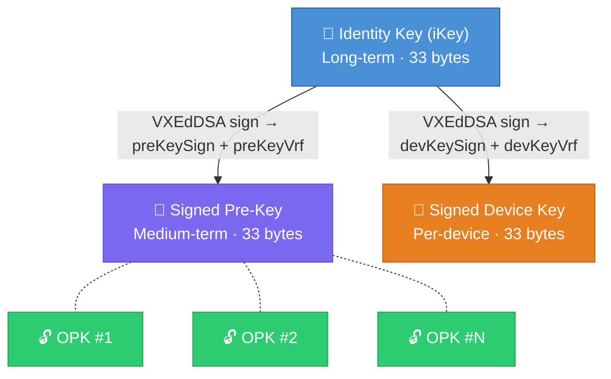
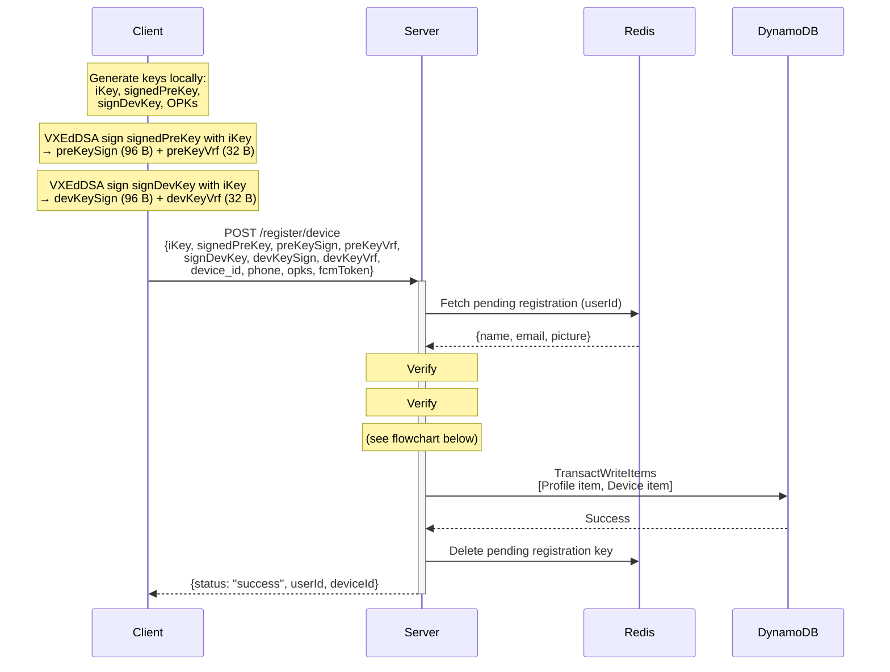
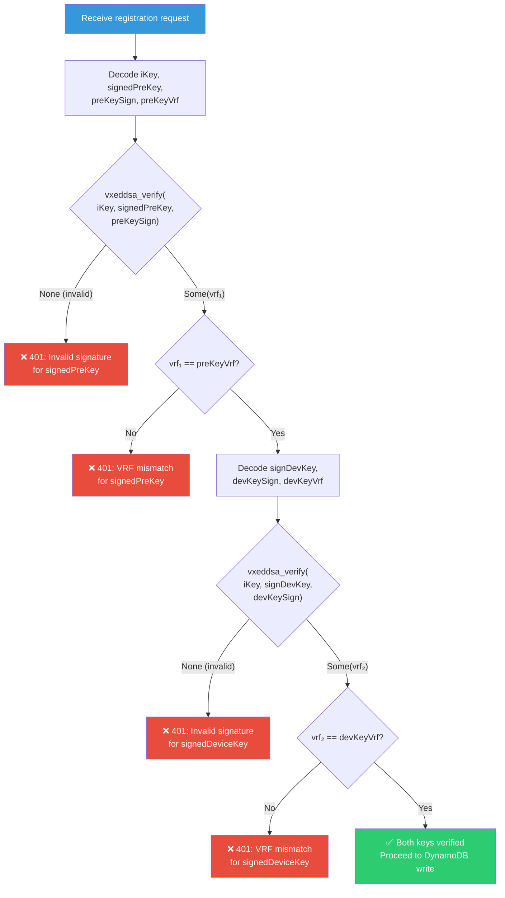
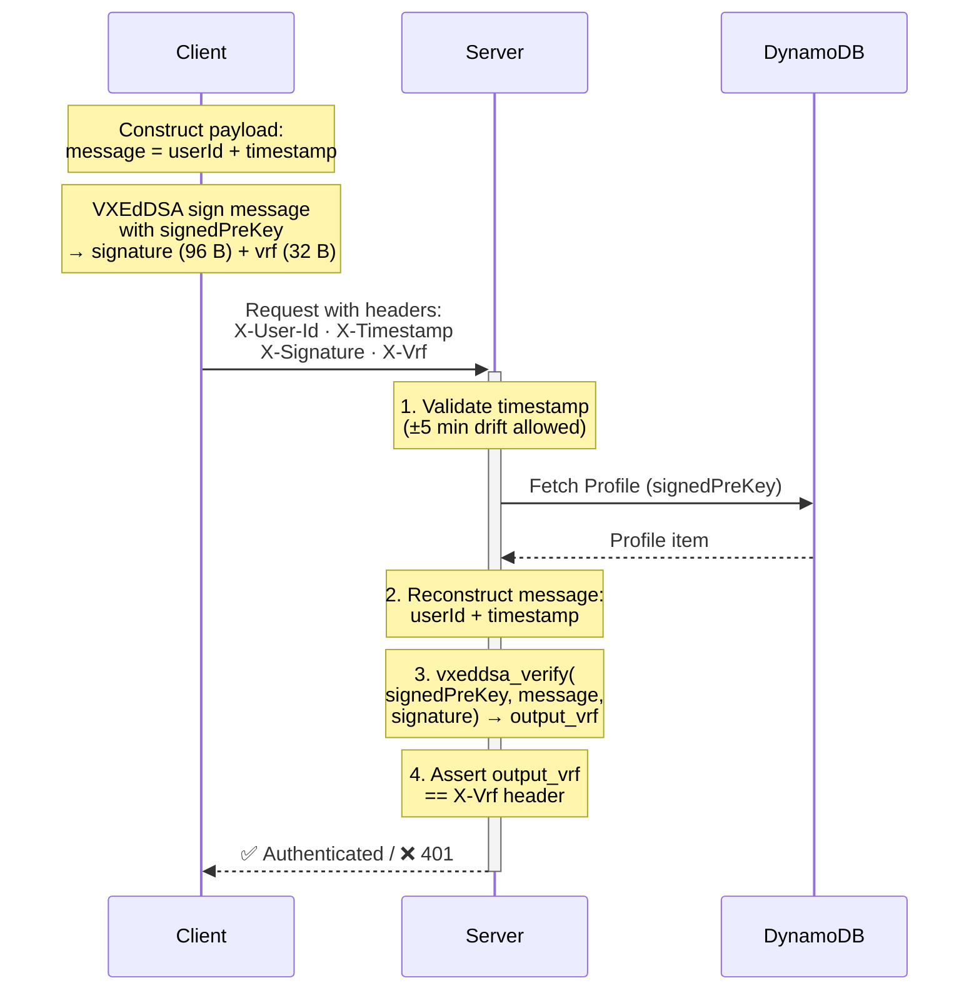
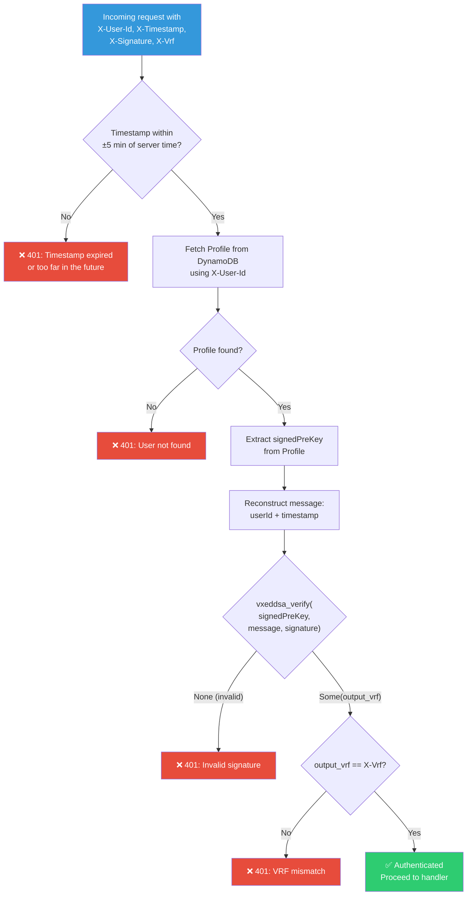
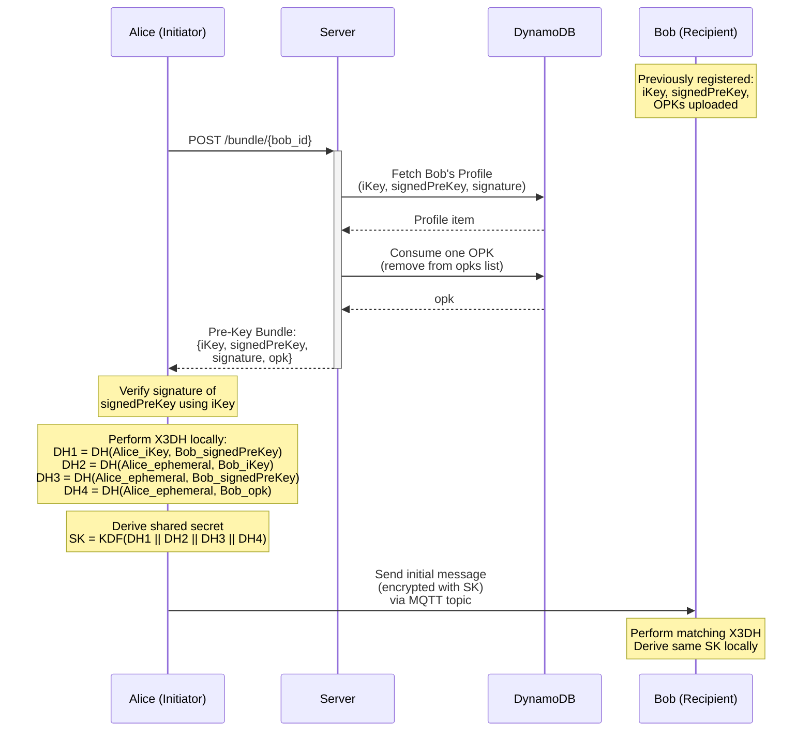
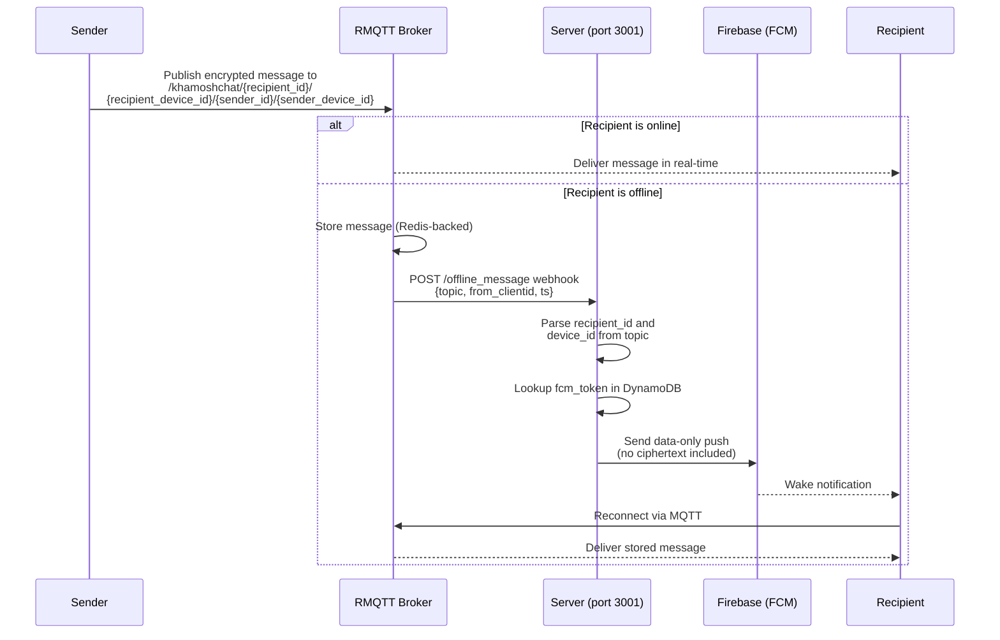

# Cryptographic Flows

This document details the cryptographic operations and verification flows used by KhamoshChat. All signatures use the **VXEdDSA** scheme, which produces both a cryptographic signature and a Verifiable Random Function (VRF) output.

---

## 1. Key Hierarchy

Each user's cryptographic identity consists of:

| Key | Type | Purpose |
| :--- | :--- | :--- |
| **Identity Key (`iKey`)** | Curve25519 (33 bytes) | Long-term identity; signs all other keys |
| **Signed Pre-Key (`signedPreKey`)** | Curve25519 (33 bytes) | Medium-term key for X3DH; also used for API authentication |
| **Signed Device Key (`signDevKey`)** | Curve25519 (33 bytes) | Per-device key signed by the Identity Key |
| **One-Time Pre-Keys (`opks`)** | Curve25519 (33 bytes each) | Ephemeral keys consumed during X3DH handshake |

### Signature Outputs (VXEdDSA)

Every VXEdDSA signature operation over a message `m` with Identity Key `iKey` produces:

- **Signature** (96 bytes): The cryptographic proof.
- **VRF output** (32 bytes): A deterministic, verifiable random value unique to `(iKey, m)`.

---

## 2. Registration: Dual-Key Verification

During device registration (`POST /register/device`), the server verifies **two** VXEdDSA signatures to ensure the client provably holds the Identity Key.

### Sequence

### Verification Flowchart

### What Gets Stored

| Table Item | Fields Stored | Fields **NOT** Stored |
| :--- | :--- | :--- |
| **Profile** | `iKey`, `signedPreKey`, `signature` (preKeySign), `opks` | `preKeyVrf`, `devKeySign`, `devKeyVrf` |
| **Device** | `signedDeviceKey`, `fcmToken` | VRF outputs |

> VRF outputs are verified at registration time and discarded. They serve as proof-of-possession but are not needed post-verification.

---

## 3. Stateless Signature Authentication

Every request to a private endpoint (`port 3001`) is authenticated using VXEdDSA without sessions or tokens.

### Sequence

### Verification Flowchart

### Security Properties

| Property | Mechanism |
| :--- | :--- |
| **Replay protection** | Timestamp must be within ±5 minutes of server time |
| **Identity binding** | Signature is over `userId + timestamp`, tying the request to a specific user |
| **Key binding** | Verified against the user's `signedPreKey` stored at registration |
| **VRF integrity** | VRF output must match, proving the signer holds the private key corresponding to `signedPreKey` |
| **Stateless** | No sessions, cookies, or JWTs; every request is independently verifiable |

---

## 4. X3DH Session Establishment

The X3DH handshake is performed entirely client-side. The server's role is limited to storing and serving Pre-Key Bundles.

### Sequence

### Pre-Key Bundle Contents

| Field | Source |
| :--- | :--- |
| `iKey` | Profile item |
| `signedPreKey` | Profile item |
| `signature` | Profile item (VXEdDSA signature of `signedPreKey`) |
| `opk` | One OPK consumed from the `opks` list (removed after retrieval) |

The initiating client uses these to perform the X3DH key agreement locally. The server never participates in the key exchange computation.

---

## 5. VXEdDSA Verification Functions

The server exposes two internal verification functions in `src/crypto.rs`:

### `verify_signed_signature(iKey, target_key, signature, vrf, field_name)`

**Used during**: Registration (called twice — once for pre-key, once for device key)

1. Decodes all Base64 inputs and validates lengths.
2. Calls `vxeddsa_verify(iKey, target_key, signature)`.
3. If verification succeeds, asserts the returned VRF matches the expected `vrf`.
4. Returns `Err(Unauthorized)` on signature failure or VRF mismatch.

### `verify_signature(public_key, message, signature)`

**Used during**: Stateless authentication (per-request)

1. Calls `vxeddsa_verify(public_key, message, signature)`.
2. Returns the VRF output on success (caller checks the match against `X-Vrf`).
3. Returns `Err(Unauthorized)` on signature failure.

---

## 6. Message Encryption & Delivery

Messages exchanged over MQTT are **opaque ciphertext**. The server never inspects, decrypts, or validates message payloads.

### Delivery Flow

